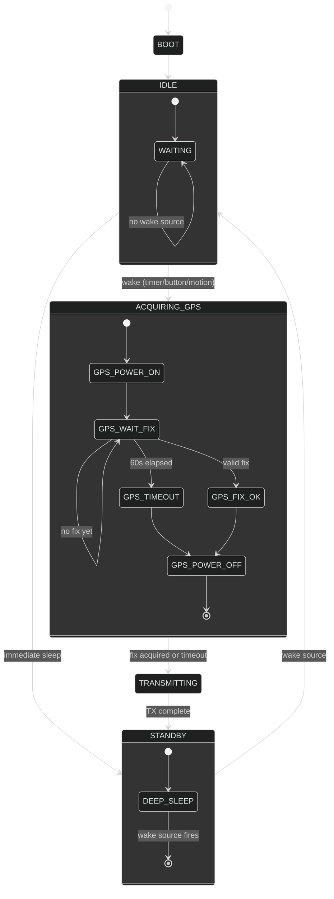
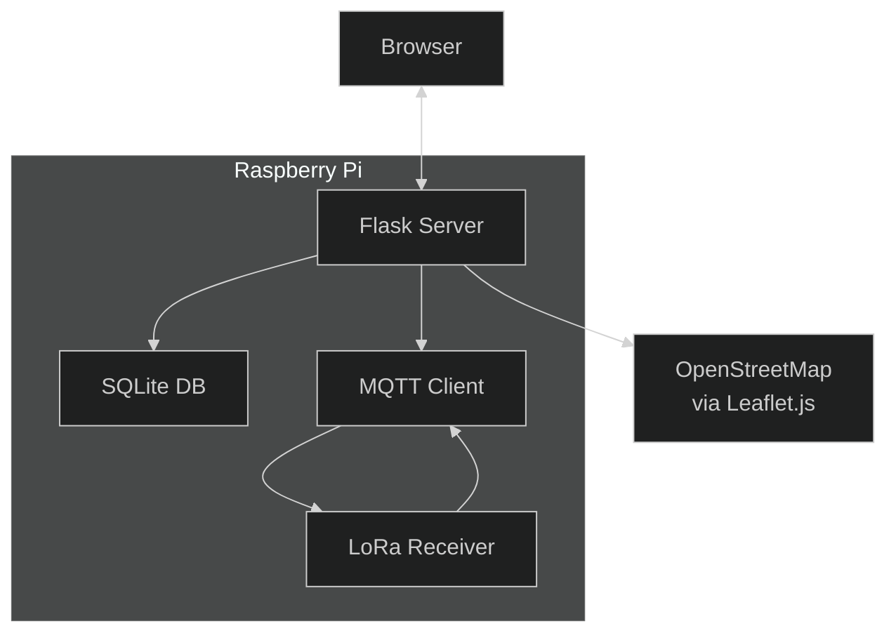

# Pet Tracker ESP32 Design

## Overview

An ESP32-based pet tracker using LoRa radio to communicate with a home base station,
which forwards data to the cloud. The device sleeps deeply between updates to maximize
battery life, waking only to acquire GPS and transmit.

**Target use case**: Pets that roam outdoors, tracked via a home base station with
cloud connectivity for remote monitoring via mobile app.

---

## Hardware

### Main Board: Seeed Studio XIAO ESP32C3

- **MCU**: ESP32-C3 (RISC-V, 160 MHz, WiFi/Bluetooth 5.0 LE)
- **Flash**: 4 MB
- **USB**: USB-C for charging and programming
- **Size**: 21 x 17.5 mm — very compact
- **Note**: ESP32-C3 has no floating-point unit (no FPU). Keep math simple or use soft-float.

### Alternative Board: XIAO ESP32S3

- **MCU**: ESP32-S3 (Xtensa, 240 MHz, with FPU)
- **Bluetooth 5.0 LE + BLE
- **USB**: USB-C
- **Size**: 21 x 17.5 mm
- **Preferred if**: You want BLE fallback for direct phone connectivity and better floating-point performance

**Recommendation**: Use **ESP32-S3** for headroom (FPU, more RAM, BLE support).

### GPS Module: u-blox NEO-6M (or compatible)

- **Interface**: UART (TX/RX)
- **Accuracy**: ~2.5 m CEP
- **Operating voltage**: 2.7–3.6 V
- **Cold start**: ~27 s typical
- **Hot start**: ~1 s
- **Active current**: ~20–25 mA during acquisition
- **Sleep current**: ~1 mA (if supported)

**Pin Mapping (XIAO → GPS)**:

| XIAO Pin | GPS Module | Function |
|----------|------------|----------|
| D4 (GPIO20) | TX | GPS data out → XIAO RX |
| D5 (GPIO21) | RX | XIAO data out → GPS TX |
| 3V3 | VCC | Power (or via LDO if needed) |
| GND | GND | Ground |

**Alternative GPS modules**:

- **MAX-M10S**: Lower power (~15 mA), faster fix, U-blox M10 platform
- **Quectel L76B**: Integrated, cheaper, but higher power
- **ATGM336H**: Very cheap, adequate for pet tracker use case

**Note**: NEO-6M is 3.3V compatible but draws significant current. Consider using a GPIO-controlled power switch to completely cut power between GPS fixes.

### Power Management

- **LDO**: Low-dropout regulator (e.g., MCP1700, 3.3 V output) for stable power
- **Voltage divider**: For battery voltage monitoring via ADC (measure Vbat)
- **Power switch**: GPIO-controlled MOSFET to cut GPS power when not in use
- **Sleep current target**:
  - SX1262: ~1 µA (very low, LoRa radio itself)
  - ESP32-S3 deep sleep: ~10–20 µA (CPU off, RTC memory retained)
  - GPS: Must be powered off completely (no true sleep on NEO-6M)
  - **Total target in deep sleep**: < 50 µA

**Power architecture**:

```
LiPo (3.7V) → MCP1700 (3.3V) → XIAO + Wio-SX1262
                    ↓
            GPIO-controlled switch → GPS module
                    ↓
            ADC voltage divider → Battery monitoring
```

### Other Components

- **Indicator LED**: Single RGB or single-color LED for status (low current, ~5 mA)
- **Reset button**: Tactile button for manual reset
- **Antenna connectors**: U.FL for LoRa (Wio-SX1262 has built-in U.FL)
- **Accelerometer**: LIS3DH (I2C) for motion detection — wakes device when pet moves
- **3D printed enclosure**: Custom case for XIAO + Wio-SX1262 + GPS + LIS3DH + battery
  - Consider: PETG or ABS for durability
  - Needs antenna clearance (LoRa U.FL antenna on top of stack)
  - Waterproofing: **silicone gasket** (reusable, adjustable, good seal)

---

## Software Architecture

### Firmware Overview

The tracker firmware is event-driven, built on ESP-IDF's FreeRTOS. Most time is spent in deep sleep; on wake, the system acquires GPS, transmits via LoRa, then returns to sleep.



### Module Structure

```
src/
├── main.rs           # Boot, initialization, main task
├── lib.rs            # Library root, shared types, error types
├── gps.rs            # GPS parsing (NMEA), location data types
├── lora/
│   ├── mod.rs        # LoRa trait/interface + shared types
│   └── sx1262.rs     # SX1262 driver implementation
├── power.rs          # Sleep, wake sources, battery monitoring
├── accelerometer.rs  # LIS3DH I2C driver for motion detection
├── ble.rs            # BLE GATT server for direct phone connectivity
├── geofence.rs       # Geofence checking (circle/polygon)
├── config.rs         # NVS storage for device config
└── error.rs          # Error types
```

### Key Interfaces

**GPS Module** (`gps.rs`):

```rust
pub struct GpsData {
    pub latitude:  i32,  // degrees * 1e6
    pub longitude: i32,  // degrees * 1e6
    pub altitude:  u16,  // meters
    pub valid:    bool,
    pub timestamp: u32, // Unix epoch
}

pub trait GpsDriver {
    fn power_on(&mut self) -> Result<()>;
    fn power_off(&mut self) -> Result<()>;
    fn read_fix(&mut self, timeout_ms: u32) -> Result<GpsData>;
}
```

**LoRa Driver** (`lora/mod.rs`):

```rust
pub struct RadioPacket {
    pub device_id:  u32,
    pub latitude:   i32,
    pub longitude:  i32,
    pub altitude:   u16,
    pub battery_mv: u16,
    pub flags:      u8,
    pub timestamp:  u32,
}

pub trait LoRaDriver {
    fn init(&mut self) -> Result<()>;
    fn send(&mut self, packet: &RadioPacket) -> Result<()>;
    fn sleep(&mut self) -> Result<()>;
}
```

**Power Management** (`power.rs`):

```rust
pub enum WakeSource {
    Timer(u32),        // RTC timer, duration in ms
    GpsTimeout,
    Button,
}

pub fn enter_deep_sleep(wake_source: WakeSource) -> !;
pub fn get_battery_voltage() -> u16;  // mV
```

### State Machine Detail

**State: STANDBY (Deep Sleep)**

- CPU off, RTC running
- Wake on: RTC timer, button press
- On wake: transition to IDLE then to appropriate state

**State: ACQUIRING_GPS**

- Turn on GPS via power switch (GPIO MOSFET)
- Poll UART for NMEA sentences (GGA, RMC)
- Parse for valid fix (latitude/longitude present)
- Timeout after 60 s → transmit with `valid=false`
- On valid fix: transition to TRANSMITTING

**State: TRANSMITTING**

- Build 20-byte packet
- Wake SX1262 from sleep
- Configure (SF7, BW125, CR4/5, +17 dBm)
- Send packet
- Wait for ACK or timeout (max 3 retries)
- Transition to STANDBY (deep sleep)

### Timing Configuration

```rust
// Configurable constants
const GPS_TIMEOUT_MS: u32 = 60_000;        // 60 seconds max GPS acquisition
const TX_RETRIES: u8 = 3;
const TX_TIMEOUT_MS: u32 = 5_000;         // Per retry timeout

// Default wake intervals (stored in NVS, configurable)
const DEFAULT_SLEEP_INTERVAL_MS: u32 = 60_000;  // 1 minute when moving
const STATIONARY_SLEEP_INTERVAL_MS: u32 = 300_000;  // 5 minutes when stationary
```

### Startup Sequence

1. **Boot** (ROM bootloader → ESP-IDF bootloader)
2. **Early init**: Configure cache, CPU frequency, Flash
3. **ESP-IDF components init**: System, WiFi (disabled), Bluetooth (disabled)
4. **Rust runtime init**: Global allocator, panic handler
5. **Driver init**:
   - Configure GPIO (power switch, LED, button)
   - Initialize SX1262 (but keep in sleep)
   - Initialize GPS (keep powered off)
6. **Read config** from NVS (device_id, sleep intervals, geofences)
7. **Check wake source**: Timer vs button vs reset
8. **Enter main loop** or **deep sleep**

### Error Handling

```rust
#[derive(Debug, Clone, Copy)]
pub enum TrackerError {
    GpsNoFix,
    GpsTimeout,
    LoraTxFailed,
    LoraNoAck,
    NvsError,
    InvalidConfig,
}

impl TrackerError {
    pub fn is_recoverable(&self) -> bool {
        matches!(self, GpsNoFix | GpsTimeout | LoraTxFailed | LoraNoAck)
    }
}
```

- **Recoverable errors**: Log, continue (e.g., no GPS fix → transmit with valid=false)
- **Unrecoverable errors**: Panic and reboot (e.g., NVS corruption)
- All errors logged via `log::error!` for diagnostics

### Configuration Storage (NVS)

Stored in flash via ESP-IDF's NVS:

| Key | Type | Default | Description |
|-----|------|---------|-------------|
| device_id | u32 | random | Unique device identifier |
| sleep_interval_ms | u32 | 60000 | Normal wake interval |
| stationary_interval_ms | u32 | 300000 | Interval when stationary |
| tx_power | u8 | 17 | LoRa TX power in dBm |
| sf | u8 | 7 | Spreading factor |
| geofence_count | u8 | 0 | Number of configured zones |
| motion_threshold | u16 | 100 | LIS3DH motion threshold (mg) |
| stationary_timeout_ms | u32 | 300000 | Time without motion to be "stationary" |

### Interrupt Handlers

Minimal interrupt handlers in embedded context:

- **GPIO button**: Wake from deep sleep on button press
- **Timer**: Wake from deep sleep on RTC alarm
- **LIS3DH INT1**: Motion detected interrupt (wake on movement)
- **SX1262 DIO1**: Packet TX/RX done interrupt (optional, polling also works)

All heavy processing deferred to main task.

### Base Station (Python on Raspberry Pi)

Raspberry Pi with LoRa hat (e.g., Raspberry Pi LoRa HAT):

```mermaid
%%{init: {'theme':'dark'}}%%
flowchart LR
    A[LoRa RX] --> B[Python Parser]
    B --> C[MQTT Bridge]
    C <--> D[HiveMQ Broker]
    C <--> E[(Phone App<br/>via MQTT)]
    A <--|ACK| B
    B <--|Command| C
```

**Roles**:

1. **LoRa gateway**: Receives packets from trackers, sends ACKs
2. **MQTT bridge**: Forwards tracker data to HiveMQ, receives commands from phone app
3. **Command relay**: Forwards commands from phone → LoRa → tracker

**Flows**:

- **Tracker → Phone**: Tracker LoRa → Base Station → HiveMQ → Phone App
- **Phone → Tracker**: Phone App → HiveMQ → Base Station → LoRa → Tracker

**Web UI** for configuration and live data viewing (Flask + HTML/JS)

### Base Station Web UI

A lightweight Flask web server runs on the Raspberry Pi, providing:

**Features**:
- **Dashboard**: Live view of all tracked pets (location, battery, signal strength)
- **Map view**: OpenStreetMap integration showing pet locations in real-time
- **Configuration**: WiFi SSID/password, MQTT broker address, LoRa settings
- **Geofence management**: Add/edit/delete geofence zones
- **Device management**: Register new trackers, view device status
- **Alerts**: Geofence breach notifications (browser notifications)

**Tech stack**:
- **Backend**: Python Flask (lightweight, runs on Pi Zero 2 W)
- **Frontend**: HTML + CSS + JavaScript (no framework, minimal footprint)
- **Map**: Leaflet.js + OpenStreetMap (free, no API key)
- **Data**: Local SQLite database for history, MQTT for live updates

**Endpoints**:

| Endpoint | Method | Description |
|----------|--------|-------------|
| `/` | GET | Dashboard with map and pet list |
| `/api/devices` | GET | List all registered devices |
| `/api/devices/<id>` | GET | Device details and latest location |
| `/api/devices/<id>/history` | GET | Location history (query params: from, to) |
| `/api/config` | GET/POST | Get/set base station configuration |
| `/api/geofences` | GET/POST/DELETE | Manage geofence zones |
| `/api/stats` | GET | System statistics (MQTT messages/sec, uptime) |

**Web UI Architecture**:



**Configuration stored in SQLite**:

| Table | Fields | Description |
|-------|--------|-------------|
| devices | id, name, device_id, created_at | Registered trackers |
| geofences | id, name, device_id, zone_type, coordinates, radius | Fence zones |
| config | key, value | WiFi, MQTT, system settings |
| location_history | device_id, lat, lon, alt, battery, timestamp | Historical data |

### Memory Considerations

- **Stack**: Keep stack usage minimal in ISRs. Main task stack ~4KB
- **Heap**: Dynamic allocation only for packet buffers, GPS NMEA parsing
- **Static**: All drivers and state machine data as static globals
- **No malloc in ISR context**: Use static buffers or stack-only allocations

### LoRa Protocol

Point-to-point LoRa from tracker to base station.

**Packet structure** (compact binary, ~20 bytes):

| Field           | Size   | Description                         |
|-----------------|--------|-------------------------------------|
| device_id       | 4 B    | Unique device identifier            |
| latitude        | 4 B    | Fixed-point (e.g., deg * 1e6)       |
| longitude       | 4 B    | Fixed-point (e.g., deg * 1e6)       |
| altitude        | 2 B    | Meters (uint16)                     |
| battery_mv      | 2 B    | Battery voltage in millivolts       |
| status_flags    | 1 B    | GPS fix valid, moving, etc.        |
| timestamp       | 3 B    | Unix epoch (seconds, mod 24h)      |

**Note**: ESP32-C3 has no built-in RTC. Use Unix timestamp from GPS or NTP sync when WiFi is available.

### Base Station (separate firmware or software)

- Raspberry Pi with Wio-SX1262 or LoRa-E5
- Another XIAO ESP32S3 with stacked Wio-SX1262 makes an excellent base station
- Receives packets from tracker via LoRa
- Forwards via WiFi to cloud (MQTT or HTTP)
- Could also act as a LoRaWAN gateway for multiple trackers

**Base station firmware options**:

1. **XIAO ESP32S3 + Wio-SX1262**: Compact, runs ESP-IDF, same LoRa driver as tracker
2. **Raspberry Pi + LoRa hat**: More compute headroom for complex gateway logic
3. **ESP32 + LoRa-E5**: Simpler firmware but higher sleep current on E5

### Cloud Backend (out of scope for this design, but for completeness)

- MQTT broker → InfluxDB or TimescaleDB → Grafana dashboard
- Optional: Twilio or push notification for geofence breach alerts

---

## LoRa Configuration (SX1262)

**Recommended settings for point-to-point pet tracker**:

| Parameter | Value | Rationale |
|-----------|-------|-----------|
| Spreading Factor (SF) | SF7–SF9 | Balance of range and speed; SF7 = ~3 km urban |
| Bandwidth (BW) | 125 kHz | Good balance of sensitivity vs speed |
| Coding Rate (CR) | 4/5 | Standard reliability |
| TX Power | +17 dBm | Good range with acceptable current (~120 mA) |
| Preamble length | 12 | Default, robust |

**Lower SF = faster TX = lower battery**. Use the highest SF that gives reliable comms at your typical distances.

**Packet format** (same as tracker-to-base):

```
[device_id: 4][lat: 4][lon: 4][alt: 2][battery_mv: 2][flags: 1][timestamp: 3] = 20 bytes
```

With SF7 + BW125k, ~20 bytes transmits in ~50–100 ms. At +17 dBm, TX current ~120 mA.

---

## Geofencing

### Types

1. **Circular geofence**: Center point + radius. Simple, low compute.
2. **Polygon geofence**: Array of lat/lon vertices. More flexible but more compute.

### Implementation

- Store geofence as a list of zones in config (NVS flash)
- Check point-in-circle: `sqrt((lat-lat0)^2 + (lon-lon0)^2) < radius`
- Use haversine formula for accurate distance on sphere
- **On breach**: Set flag in next transmission, trigger alert from cloud

**Compute constraint**: ESP32-C3 has no FPU. Use integer math or lookup tables for haversine. Consider offloading geofence check to base station or cloud if compute is tight.

---

## Mobile App (Future)

Mobile app connects to HiveMQ broker via base station's MQTT bridge to receive location updates and send commands.


**Features**:

- View current location on map (OpenStreetMap or Google Maps)
- Set/edit geofence zones (synced via MQTT)
- Receive push notifications on geofence breach
- View battery level and signal strength
- Historical location trail

**Connectivity options**:

| Method | When | Protocol |
|--------|------|----------|
| Direct BLE | Phone within ~10m of tracker | BLE GATT |
| Via HiveMQ | Phone anywhere with internet | MQTT over WebSocket |
| Via base station | Phone on local network | HTTP REST |

**Tech stack options**:

- **PWA** (recommended): Works on iOS/Android via browser, no app store required
- **Native**: Swift/SwiftUI (iOS) or Kotlin/Jetpack (Android)
- **Both**: PWA as fallback, native app for push notifications

**MQTT Topics**:

| Topic | Direction | Payload |
|-------|-----------|---------|
| `pettracker/{device_id}/location` | Base → Phone | `{lat, lon, battery, timestamp}` |
| `pettracker/{device_id}/status` | Base → Phone | `{rssi, moving, geofence_breach}` |
| `pettracker/{device_id}/command` | Phone → Base → Tracker | `{cmd: "ping" \| "config" \| "alarm"}` |
| `pettracker/{device_id}/config` | Phone → Base → Tracker | `{sleep_interval, geofences}` |

The base station acts as an MQTT bridge: it receives LoRa packets and republishes to HiveMQ, and forwards commands from the phone app to the tracker via LoRa.

---

## Power Budget (Estimate)

Using SX1262 sleep current (~1 µA) + LIS3DH (~3 µA in low-power mode):

| State           | Current  | Duration  | Charge used (500 mAh) |
|-----------------|----------|-----------|----------------------|
| Deep sleep      | 4 µA    | ~55 min   | 0.004 mAh           |
| GPS acquire     | 25 mA   | 30 s      | 0.208 mAh           |
| LoRa TX         | 120 mA  | 2 s       | 0.067 mAh           |
| **Per cycle**   |          | ~60 s     | **0.279 mAh**       |

At one cycle per minute: 0.279 mAh × 60 min × 24 hours = **~401 mAh/day**

With a 500 mAh battery: **~1.25 days** at 1-minute intervals.

**Motion-triggered wake significantly improves battery life**: If pet is stationary 75% of the time and LIS3DH wakes device only on motion, average daily consumption drops to ~100 mAh/day,
giving **~5 days** battery life.

**To extend battery life**:

- Increase sleep interval when stationary (e.g., 5 min via LIS3DH motion detection)
- Use GPS caching (if velocity is low, reuse last known location)
- Reduce LoRa TX power to minimum needed for reliable comms
- Use lower SF (Spreading Factor) to reduce TX time

---

## Open Questions / Tradeoffs

All questions have been answered:

1. **GPS module choice** → **NEO-6M**: Cheap, reliable, 25 mA during acquisition
2. **LoRa frequency** → **915 MHz (US)**: For North/South America regions
3. **Base station form factor** → **Raspberry Pi + LoRa hat**: (see Base Station section)
4. **Cloud backend** → **HiveMQ** (self-hosted): (see TODO section)
5. **Accelerometer** → **LIS3DH included**: Motion detection for intelligent wake
6. **GPS power switching** → **GPIO-controlled MOSFET**: Essential for low deep-sleep current
7. **Enclosure waterproofing** → **Silicone gasket**: Reusable, adjustable, good seal

---

## Bill of Materials (BOM)

See [BOM.md](BOM.md) for full component list with part numbers, pricing, vendor links, and order checklist.

---

## TODO Before Build

- [x] ~~Select final board~~ → **XIAO ESP32S3** (FPU, BLE, more RAM)
- [x] ~~Select LoRa radio~~ → **Wio-SX1262** (SX1262, low power SPI)
- [x] ~~Select base station~~ → **Python on Raspberry Pi** with LoRa hat
- [x] ~~Select MQTT broker~~ → **HiveMQ** (self-hosted)
- [x] ~~Select GPS module~~ → **NEO-6M** (cheap, reliable, 25 mA)
- [x] ~~Select LoRa frequency~~ → **915 MHz (US)**
- [x] ~~Select waterproofing~~ → **Silicone gasket** (reusable, good seal)
- [ ] Design power supply (charger + LDO + power switch for GPS)
- [ ] Verify Wio-SX1262 pin mapping with actual board
- [ ] Order components:
  - [ ] XIAO ESP32S3
  - [ ] Wio-SX1262 (915 MHz variant)
  - [ ] NEO-6M GPS module
  - [ ] LIS3DH accelerometer
  - [ ] LiPo battery (500–1000 mAh)
  - [ ] MCP1700 LDO
  - [ ] TP4056 charger
  - [ ] N-channel MOSFET (for GPS power switching)
  - [ ] Voltage divider resistors (for battery monitoring)
  - [ ] Enclosure materials / 3D printer filament
  - [ ] Raspberry Pi Zero 2 W (for base station)
  - [ ] LoRa hat for Raspberry Pi (for base station)
- [ ] Design PCB or protoboard layout
- [ ] Design 3D-printed enclosure with silicone gasket groove
- [ ] Implement tracker firmware (see Software Architecture)
- [ ] Implement base station Python script
- [ ] Set up HiveMQ broker
- [ ] Set up cloud backend (MQTT broker + database)
