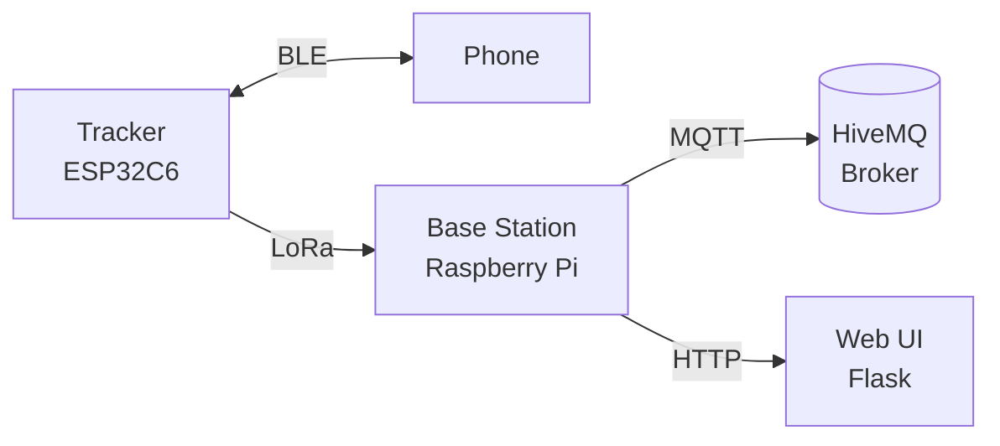

# Pet Tracker for ESP32

[](https://isocpp.org/)
[](https://docs.espressif.com/projects/esp-idf/en/stable/esp32c6/)
[](LICENSE)
[](LICENSE-DESIGNS)
[](https://github.com/pre-commit/pre-commit)

ESP32-based pet tracker using LoRa radio to communicate with a home base station, which forwards data to the cloud.

## Features

- **GPS tracking** with NEO-6M module and ~2.5m accuracy
- **LoRa radio** (SX1262) for long-range communication to base station
- **BLE fallback** for direct phone connectivity when in range
- **Motion detection** via LIS3DH accelerometer for intelligent wake cycles
- **Deep sleep** for maximum battery life
- **Web UI** on base station for live tracking and configuration

## Hardware

| Component | Part |
|-----------|------|
| MCU | ESP32-C6 (RISC-V) |
| LoRa | Seeed Wio-SX1262 for XIAO (915 MHz) |
| GPS | u-blox NEO-6M |
| Accelerometer | LIS3DH |
| Battery | LiPo 500mAh |

See [docs/hardware/DESIGN.md](docs/hardware/DESIGN.md) for full hardware documentation.

## Architecture



## Project Structure

```
esp32-pet-tracker/
├── firmware/              # C++ ESP-IDF firmware
│   ├── CMakeLists.txt
│   ├── build.sh          # Docker-based build
│   ├── sdkconfig.defaults
│   └── main/
│       └── main.cpp       # Application entry
├── hardware/              # KiCad PCB designs & enclosure
│   ├── tracker/          # Pet tracker PCB
│   ├── base_station/     # Base station PCB
│   └── enclosure/        # 3D printed case
├── base_station/         # Python Flask web app
├── docs/                 # Documentation
│   ├── hardware/         # Hardware design docs
│   ├── firmware/         # Firmware docs
│   ├── datasheets/       # Component datasheets
│   └── plans/            # Implementation plans
├── third_party/          # Vendor libraries
└── .github/workflows/     # CI/CD pipelines
```

## Firmware

Built with C++ and ESP-IDF framework using Docker.

### Prerequisites

- Docker

### Build

```bash
cd firmware
./build.sh
```

### Flash

```bash
docker run --rm -v $(pwd):/workspace -w /workspace espressif/idf:v5.3.1 \
  sh -c ". /opt/esp/idf/export.sh && idf.py -p /dev/ttyACM0 flash monitor"
```

## Base Station

Python 3 on Raspberry Pi with:
- Flask web server
- SQLite database
- Leaflet.js + OpenStreetMap for live tracking

## Documentation

| Document | Description |
|----------|-------------|
| [docs/hardware/DESIGN.md](docs/hardware/DESIGN.md) | Full hardware design |
| [docs/hardware/BOM.md](docs/hardware/BOM.md) | Bill of materials |
| [docs/plans/](docs/plans/) | Implementation plans |
| [docs/firmware/DEPENDENCIES.md](docs/firmware/DEPENDENCIES.md) | Build dependencies |

## License

- **Firmware** (`firmware/`): [Personal Use Only](LICENSE)
- **Hardware & Documentation** (`hardware/`, `docs/`): [CC BY-NC-SA 4.0](LICENSE-DESIGNS)
