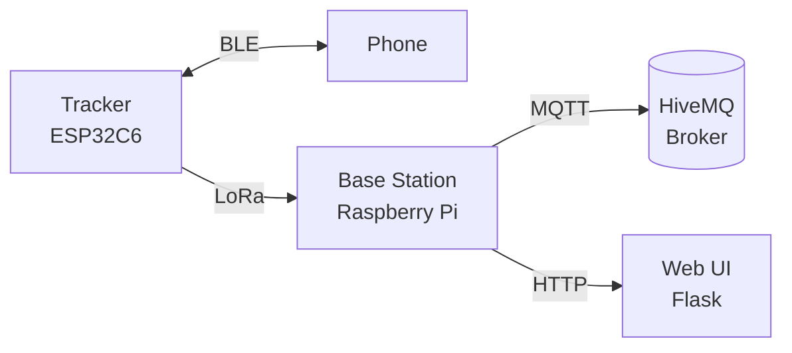

# LoRaPaws32

[](LICENSE)
[](LICENSE-DESIGNS)

LoRa-based pet tracker with GPS tracking, LoRa radio communication, and web UI.

## Repositories

This is a meta-repo. The project components are in separate repositories:

| Repository | Description |
|------------|-------------|
| [lorapaws32-firmware](https://github.com/gdellis/lorapaws32-firmware) | ESP-IDF C++ firmware for ESP32-S3/C6 |
| [lorapaws32-hardware](https://github.com/gdellis/lorapaws32-hardware) | KiCad PCB designs and enclosure files |
| [lorapaws32-base-station](https://github.com/gdellis/lorapaws32-base-station) | Python Flask web app for Raspberry Pi |

## Quick Start

Clone all repositories at once:
```bash
bash clone-all.sh
```

## Architecture



## Contract Documents

These documents define the interfaces between components:

| Document | Description |
|----------|-------------|
| [docs/hardware/PINOUT.md](docs/hardware/PINOUT.md) | Pin assignments and hardware connections |
| [docs/PROTOCOL.md](docs/PROTOCOL.md) | LoRa packet binary format specification |

## Documentation

| Document | Description |
|----------|-------------|
| [docs/hardware/PINOUT.md](docs/hardware/PINOUT.md) | Pin assignments and hardware connections |
| [docs/PROTOCOL.md](docs/PROTOCOL.md) | LoRa packet format between firmware and base station |

## License

- **Code** (firmware, base station): [MIT License](LICENSE)
- **Hardware designs & documentation**: [CC BY-NC-SA 4.0](LICENSE-DESIGNS)
