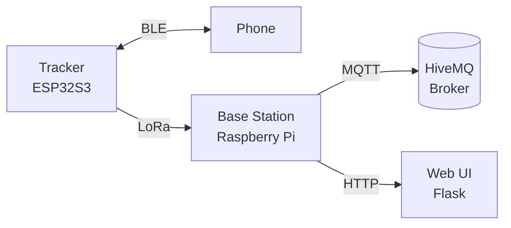

# Pet Tracker for ESP32

[](https://www.rust-lang.org/)
[](https://www.rust-lang.org/)
[](https://www.espressif.com/)
[](LICENSE)
[](LICENSE-DESIGNS)
[](https://github.com/gdellis/esp32-pet-tracker/stargazers)
[](https://github.com/gdellis/esp32-pet-tracker/network/members)

ESP32-based pet tracker using LoRa radio to communicate with a home base station, which forwards data to the cloud. Built with Rust.

## Features

- **GPS tracking** with NEO-6M module and ~2.5m accuracy
- **LoRa radio** (SX1262) for long-range communication to base station
- **BLE fallback** for direct phone connectivity when in range
- **Motion detection** via LIS3DH accelerometer for intelligent wake cycles
- **Geofencing** with circular and polygon zone support
- **Deep sleep** for maximum battery life
- **Web UI** on base station for live tracking and configuration

## Hardware

| Component | Part |
|-----------|------|
| MCU | Seeed Studio XIAO ESP32S3 |
| LoRa | Seeed Wio-SX1262 for XIAO (915 MHz) |
| GPS | u-blox NEO-6M |
| Accelerometer | LIS3DH |
| Battery | LiPo 500mAh |

See [DESIGN.md](DESIGN.md) for full hardware documentation.

## Architecture



See [DESIGN.md](DESIGN.md) for detailed software architecture.

## Project Structure

```
├── AGENTS.md          # Development guidelines for agents
├── DESIGN.md          # Full design document
├── PLAN.md            # Implementation plan
├── BOM.md             # Bill of materials
├── DEPENDENCIES.md    # Required software and Rust crates
├── LICENSE            # Firmware: Personal Use Only
├── LICENSE-DESIGNS   # Docs/designs: CC BY-NC-SA 4.0
├── README.md          # This file
├── .markdownlint.json # Markdown linting config
├── .pre-commit-config.yaml
├── Cargo.toml         # Rust dependencies
├── build.rs           # Build script
├── src/
│   ├── lib.rs         # Library root
│   ├── main.rs        # Application entry point
│   └── error.rs       # Error types
├── base_station/      # Python base station (future)
└── kicad/            # Hardware designs
```

## Firmware

Built with Rust + ESP-IDF. See [AGENTS.md](AGENTS.md) for development guidelines and [DEPENDENCIES.md](DEPENDENCIES.md) for required software.

```bash
# Install dependencies (see DEPENDENCIES.md for details)
# Then build for ESP32S3:
cargo build --release --target xtensa-esp32s3-espidf

# Flash to device
espflash flash /dev/ttyUSB0 --monitor
```

## Base Station

Python 3 on Raspberry Pi with:
- Flask web server
- SQLite database
- Leaflet.js + OpenStreetMap for live tracking

See [PLAN.md](PLAN.md) for implementation timeline.

## Status

Design complete. Project scaffold initialized, firmware implementation in progress.

## References

- [ESP-IDF Rust Book](https://docs.espressif.com/projects/rust/book/preface.html)
- [esp-rs/awesome-esp-rust](https://github.com/esp-rs/awesome-esp-rust)

## License

- **Firmware** (`src/`, `base_station/`): [Personal Use Only](LICENSE)
- **Documentation & Designs** (`DESIGN.md`, `BOM.md`, `PLAN.md`, `enclosure/`): [CC BY-NC-SA 4.0](LICENSE-DESIGNS)
