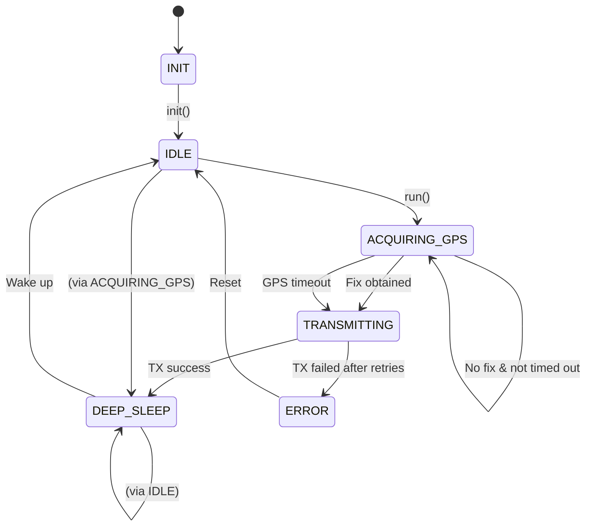

# State Machine

Tracker firmware state machine managing power cycles, GPS acquisition, and data transmission.

## State Diagram

## States

| State | Description |
|-------|-------------|
| INIT | Initialization, loads configuration |
| IDLE | Updates activity timestamp, transitions to GPS acquisition |
| ACQUIRING_GPS | Powers on GPS, waits for fix or timeout (60s) |
| TRANSMITTING | Sends location via LoRa, falls back to BLE |
| DEEP_SLEEP | Enters deep sleep, waits for wake source |
| ERROR | TX failed, sleeps with stationary interval |

## Wake Sources

| Source | Description |
|--------|-------------|
| TIMER | Periodic wake based on configured interval |
| BUTTON | User button press (5s sleep) |
| MOTION | Accelerometer interrupt detected movement |

## Transitions

### IDLE → ACQUIRING_GPS

- Updates `last_activity_time`
- GPS is powered on

### ACQUIRING_GPS → TRANSMITTING

- GPS is powered off
- If fix obtained: `check_geofence()` runs
  - If outside zone: BLE alert sent, `is_moving = true`
- Location data transmitted via LoRa

### DEEP_SLEEP

- Determines sleep duration from wake source and motion state
- Configures wakeup sources (GPIO, accelerometer)
- Enters deep sleep via FreeRTOS idle task

### Wake → IDLE

- `last_wake` updated from wake source
- `is_moving` set true if motion wake, false if timer wake
- GPS fix flag cleared for next cycle

## Geofence Integration

After GPS fix is obtained in `ACQUIRING_GPS` state:

1. Current location is checked against all configured zones
2. If outside any zone: breach detected
3. BLE alert notification sent with zone index and location
4. `is_moving` flag set to trigger frequent updates
